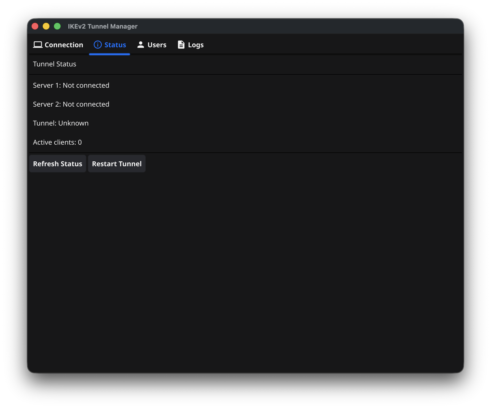
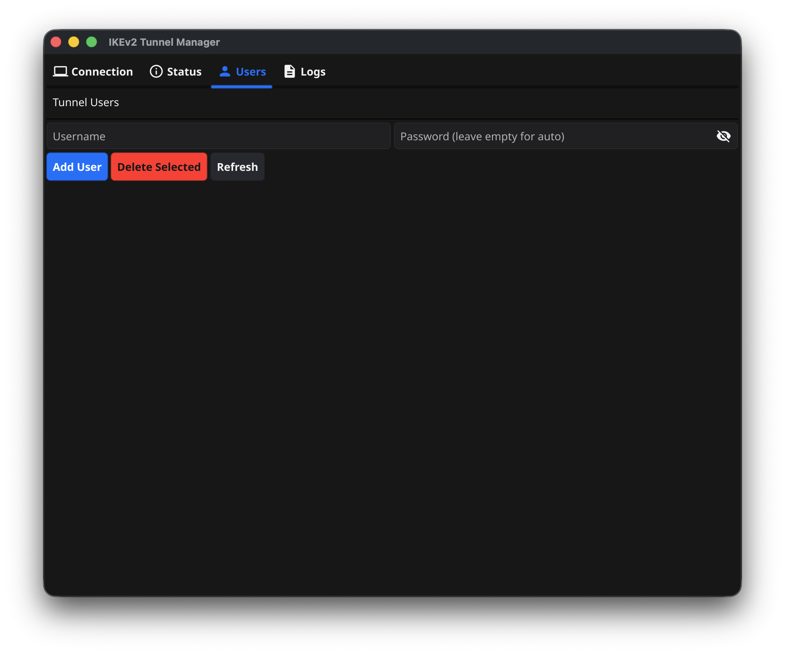

# IKEv2 Tunnel Manager

[](https://github.com/vailcody/IKEv2TunnelManager/actions/workflows/ci.yml)
[](https://github.com/vailcody/IKEv2TunnelManager/actions/workflows/release.yml)
[](https://opensource.org/licenses/MIT)

Кроссплатформенное GUI приложение для настройки и управления двухуровневым IKEv2 туннелем.

## 📸 Скриншоты


*Вкладка Connection — настройка серверов*


*Вкладка Status — мониторинг туннеля*


*Вкладка Users — управление пользователями*

## 📥 Скачать

Перейдите на [страницу Releases](https://github.com/vailcody/IKEv2TunnelManager/releases/latest) и скачайте версию для вашей операционной системы:

| Платформа | Архитектура | Файл |
|-----------|-------------|------|
| 🐧 Linux | x64 | `tunnelmanager-linux-amd64.tar.gz` |
| 🐧 Linux | ARM64 | `tunnelmanager-linux-arm64.tar.gz` |
| 🍎 macOS | Intel | `tunnelmanager-macos-amd64.tar.gz` |
| 🍎 macOS | Apple Silicon | `tunnelmanager-macos-arm64.tar.gz` |
| 🪟 Windows | x64 | `tunnelmanager-windows-amd64.zip` |

## 🏗 Архитектура

```
[User] → [Server 1: Tunnel Server + Client] → [Server 2: Exit Node] → [Internet]
```

Пользователь подключается к Server 1, трафик проходит через Server 2, и получает IP-адрес Server 2.

## 📋 Требования

- Go 1.21+ (для сборки из исходников)
- Ubuntu 20.04+ на целевых серверах
- Root-доступ (sudo) на обоих серверах
- Открытые порты: 500/udp, 4500/udp

## 🚀 Установка

### Из релизов (рекомендуется)

1. Скачайте архив для вашей ОС со [страницы Releases](https://github.com/vailcody/IKEv2TunnelManager/releases/latest)
2. Распакуйте:
   ```bash
   # Linux/macOS
   tar -xzvf tunnelmanager-*.tar.gz
   chmod +x tunnelmanager-*
   ./tunnelmanager-*
   
   # Windows - распакуйте ZIP и запустите .exe
   ```

### Из исходников

```bash
# Клонирование
git clone https://github.com/vailcody/IKEv2TunnelManager
cd IKEv2TunnelManager

# Сборка
go build -o tunnelmanager ./cmd/vpnmanager

# Запуск
./tunnelmanager
```

### Зависимости для сборки (Linux)

```bash
sudo apt-get install libgl1-mesa-dev xorg-dev
```

## 📖 Использование

### Вкладка Connection

1. Введите параметры SSH для обоих серверов:
   - **Host**: IP-адрес или hostname
   - **User**: пользователь SSH (обычно root)
   - **Password** или **SSH Key**: способ аутентификации

2. Нажмите **Test Connections** для проверки подключений

3. Нажмите **Setup IKEv2 Tunnel** для полной настройки

### Вкладка Status

- Просмотр текущего состояния туннеля
- Количество активных клиентов
- Статус туннеля между серверами
- Кнопки для перезапуска туннеля

### Вкладка Users

- Добавление/удаление пользователей туннеля
- Список существующих пользователей

### Вкладка Logs

- Журнал операций приложения
- Получение логов StrongSwan с серверов

## 📱 Подключение клиентов

После настройки используйте следующие параметры для подключения:

- **Server**: IP-адрес Server 1
- **Type**: IKEv2
- **Authentication**: Username/Password
- **Username/Password**: созданные во вкладке Users

### iOS/macOS
Settings → VPN → Add VPN Configuration → IKEv2 (IKEv2 Tunnel)

### Windows
Settings → Network → VPN → Add a VPN connection → IKEv2

### Android
Используйте приложение strongSwan VPN Client

## 🔧 Разработка

### Кросс-компиляция

```bash
# Linux
GOOS=linux GOARCH=amd64 go build -o tunnelmanager-linux ./cmd/vpnmanager

# Windows
GOOS=windows GOARCH=amd64 go build -o tunnelmanager.exe ./cmd/vpnmanager

# macOS
GOOS=darwin GOARCH=amd64 go build -o tunnelmanager-mac ./cmd/vpnmanager
```

### Запуск тестов

```bash
go test -v ./...
```

## 🤝 Contributing

Мы приветствуем вклад в проект! Смотрите [CONTRIBUTING.md](CONTRIBUTING.md) для деталей.

## 📄 License

MIT License - смотрите [LICENSE](LICENSE) для деталей.
